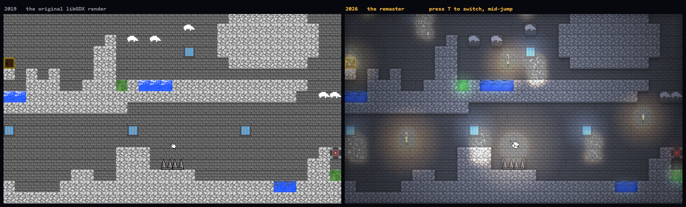
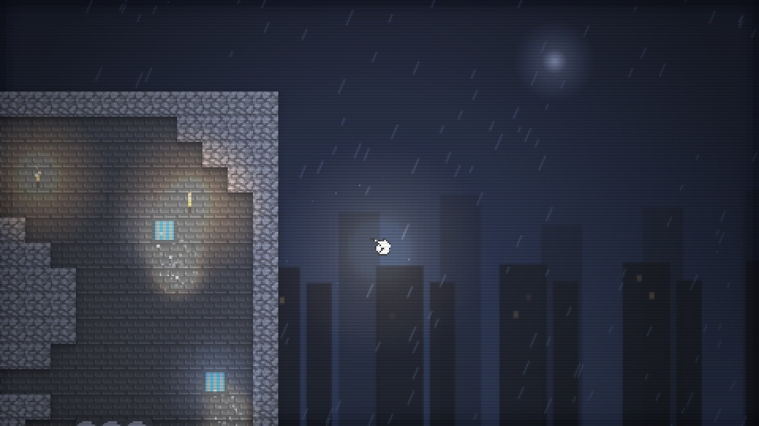

<div align="center">

# Prison Revelations 2.0

**A platformer two friends wrote in Java in 2019 — kept exactly as it was, and rebuilt so you can actually play it.**

[**▶ Play it in your browser**](https://keyfive5.github.io/Platformer-Game-Java/) · [The 2019 source](original/) · [How the port works](#how-the-port-works)

*Hasan Zafar × Bilal Junejo*



<sub><b>Left:</b> exactly what our Java build drew in 2019. <b>Right:</b> the same map, the same tile sheet, the same physics — with the lights on. It is one keypress between them.</sub>

</div>

---

## The short version

In 2019, two of us sat at one keyboard and built a game in libGDX. Three levels, one
prisoner named Porter, a tile set we drew ourselves, and a soundtrack we definitely did
not have the rights to. It ran on our laptops in Eclipse and nowhere else. When it
worked, we lost our minds.

Then it sat in a `.zip` for six years.

This repository is both halves of that story:

- **[`original/`](original/)** — the 2019 project, untouched. Same package name
  (`net.hasanbilal.pr` — *has*an + *bilal*), same comments, same variable called `wd`
  because we were too embarrassed to write "Watch Dogs" out in full.
- **[`docs/`](docs/)** — the same game, rebuilt to run in a browser. Not a
  re-imagining. It loads our original `.tmx` maps and our original tile sheet, and it
  runs Porter on the same physics constants, pulled line by line out of the Java.

Press <kbd>T</kbd> while playing to strip the remaster away and see the raw 2019 render.
That toggle is the whole point of this repo.

---

## What we actually built in 2019

<table>
<tr><td><b>Engine</b></td><td>libGDX 1.9 on LWJGL, Java 7 source level</td></tr>
<tr><td><b>Levels</b></td><td>Three maps drawn in Tiled, two tile layers each, 62 × 37 tiles</td></tr>
<tr><td><b>Art</b></td><td>An 11-tile, 176 × 16 pixel sheet. Porter was drawn by hand.</td></tr>
<tr><td><b>Entities</b></td><td>Loaded from JSON so we could move the spawn without recompiling</td></tr>
<tr><td><b>Entry point</b></td><td><code>DesktopLauncher.java</code> — the comment still says <i>"START HERE"</i></td></tr>
</table>

The mechanics, all of them:

| Tile | What it does |
| --- | --- |
| 🟩 **Slime** | Sets your vertical velocity to `200`. Launches you three storeys. |
| 🟥 **Bomb** | Deletes the tile directly under your feet. The floor just leaves. |
| ⬛ **Spikes** | Back to the start of the level. |
| 🟦 **Water** | Same, but you get eight pixels of grace before it counts. |
| 🚪 **Door** | Next level. Walk into it. |

Three doors. The third one ends the game.

---

## The parts that were harder than they should have been

Every one of these is still in the source, exactly where we left it.

**The door that had two IDs.** Tiled kept renumbering our tile set between saves, so the
door came out as global id `31` in level 1 and `11` in levels 2 and 3. We never found
the real cause — we imported the same tile set three times and the ids shifted. What we
did instead is in `TileType.java`:

```java
DOOR(31, false, "Door"),
DOORD(11, false, "Door"); // A duplicate of door had to be made because Tiled
                          // kept interchanging the IDs with '11' and '31'... strange
```

Two enum constants for one door. It shipped. It still ships — the port carries the same
duplicate, because fixing it would be fixing the wrong thing.

**Everything was `static`.** `Entity.pos` and `Entity.velocityY` are static fields, which
means Porter's position belonged to the *class*, not to Porter. With one entity in the
game you never notice. It is the kind of bug that only bites the version of you that
tries to add a second character, and we never got there.

**Respawn points are four hard-coded `if` statements.** In three separate places.
`Entity.java` checks `PrisonRevelations.level == 1 / 2 / 3` for spikes, for water, and
again for the door. We knew it was wrong while we were typing it.

**The ending.** The entire victory sequence:

```java
} else if (PrisonRevelations.level == 4) {
    System.out.println("You escaped!! Yay!");
    System.exit(0);
}
```

A print statement and a slammed door. We were *thrilled*.

---

## What the 2026 rebuild adds

The rule for the port was simple: **nothing that changes what the game is.** The maps,
the art, the physics, the hazards and the level order are all the 2019 originals. What
got added is everything that sits on top:

- **Light.** Ambient darkness with real light sources — Porter carries a lamp, doors
  glow, bombs pulse, cell windows throw shafts across the floor, torches burn on the
  brickwork. Bloom on top.
- **Weather and depth.** Rain, a moon, drifting parallax cell blocks with lit windows,
  and a searchlight sweeping the yard.

  

- **Feel.** Squash and stretch, landing dust, coyote time and a jump buffer, screen
  shake, hit-stop on explosions, a proper death burst.
- **A real ending**, instead of `System.exit(0)`.
- **A score synthesised in WebAudio**, because the original looped a copyrighted OST
  (see [licensing](#licensing-and-the-missing-mp3)).
- **Speedrun timer, per-level bests, level select, touch and gamepad support.**
- **The <kbd>T</kbd> toggle** — flips the renderer back to the 2019 build mid-jump:
  flat tiles, white void, no lights, no assists, camera glued to Porter exactly like
  `OrthographicCamera.position.set(Porter.pos.x, Porter.pos.y, 0)`.

### Physics, transcribed rather than reinvented

The port is not "close enough". These are the numbers, and where they came from:

| Constant | Value | Source |
| --- | --- | --- |
| Gravity | `-9.8 × 20 = -196 px/s²` | `GMap.update()` passes `-9.8f`; `EntityType.PLAYER` weight is `20` |
| Run speed | `80 px/s` | `Porter.SPEED` |
| Jump impulse | `+100 px/s` | `Porter.JUMP_VELOCITY (5) × weight (20)` |
| Hold boost | `+100 px/s²` while rising | `Porter.update()`, second branch |
| Slime launch | `velocityY = 200` | `Entity.update()` |
| Porter's hitbox | `9 × 7 px` | `EntityType.PLAYER` |
| Tile size | `16 px` | `TileType.TILE_SIZE` |

The order of operations is copied too — jump, then gravity, then the vertical sweep, then
spikes, water, slime, bomb, door, and only then horizontal movement. That ordering is why
the original lets you bunny-hop by holding <kbd>↑</kbd> on the ground, and the 2019 mode
still does.

---

## How the port works

```
original/core/assets/*.tmx ──► tools/tmx2js.mjs ──► docs/js/levels.js ──► the browser
        (2019, untouched)         (build step)        (generated data)
```

`tools/tmx2js.mjs` reads the original Tiled files and bakes them into a plain JS module.
Two things have to be translated on the way:

1. **Row order.** Tiled writes rows top-down; libGDX's `TiledMapTileLayer` indexes
   bottom-up. The generator flips them so row 0 is the floor, matching
   `GMap.getByCoordinate()`.
2. **Global tile ids.** libGDX's `TiledMapTile.getId()` returns the *global* id, which is
   exactly what `TileType.getTileTypeById()` switches on — so the port keeps gids verbatim
   as gameplay ids and only resolves the *drawing* column per tile set. That is what makes
   the `31` / `11` door duplicate work unchanged.

Regenerate after editing a map:

```bash
node tools/tmx2js.mjs
```

There is no bundler, no framework and no dependency. `docs/` is five files and two PNGs,
served straight off GitHub Pages.

---

## Running it

**The remaster** — just open <https://keyfive5.github.io/Platformer-Game-Java/>.
To run it locally:

```bash
node tools/devserver.mjs
```

**The 2019 Java version** — see [`original/README.md`](original/README.md). It needs a
libGDX 1.9 classpath and the missing audio file; the instructions are there.

### Controls

<kbd>←</kbd> <kbd>→</kbd> move · <kbd>↑</kbd> jump (hold for height) · <kbd>R</kbd> restart ·
<kbd>P</kbd> pause · <kbd>T</kbd> **2019 build** · <kbd>M</kbd> mute · <kbd>F</kbd> fullscreen

Music is **off by default** and quiet when you turn it on, in the pause menu.

---

## Licensing and the missing mp3

The code here is ours, released under the [MIT licence](LICENSE).

The 2019 build streamed `Watch Dogs Police Chase Music OST.mp3` — a 6 MB rip of a
Ubisoft soundtrack, loaded on line 51 of `PrisonRevelations.java`. It is **not** in this
repository, and it is not on the live site, because it was never ours to distribute. The
Java source still references it, so the original will not launch until you drop an mp3 of
that name into `original/core/assets/`. Any track will do.

The remaster synthesises its own score instead — a few oscillators and a scheduler in
[`docs/js/audio.js`](docs/js/audio.js), zero bytes over the wire.

---

## Repository layout

```
original/            the 2019 project, preserved
  core/src/          game logic — PrisonRevelations, Entity, Porter, GMap, TileType
  core/assets/       the .tmx maps, the tile sheet, Porter
  desktop/src/       DesktopLauncher — "START HERE"
docs/                the browser remaster (GitHub Pages root)
  js/game.js         the physics port and the renderer
  js/levels.js       generated from the original maps
  js/audio.js        the synthesised score
  js/fx.js           particles and weather
tools/tmx2js.mjs     Tiled -> JS build step
tools/devserver.mjs  local preview server
```

---

<div align="center">

**Six years is a long time to leave something in a zip file.**

Built in 2019 by Hasan Zafar and Bilal Junejo. Rebuilt in 2026, without changing a single level.

</div>
